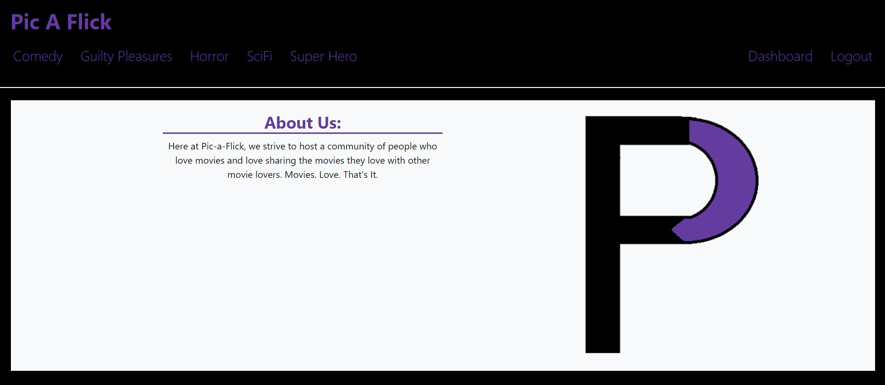
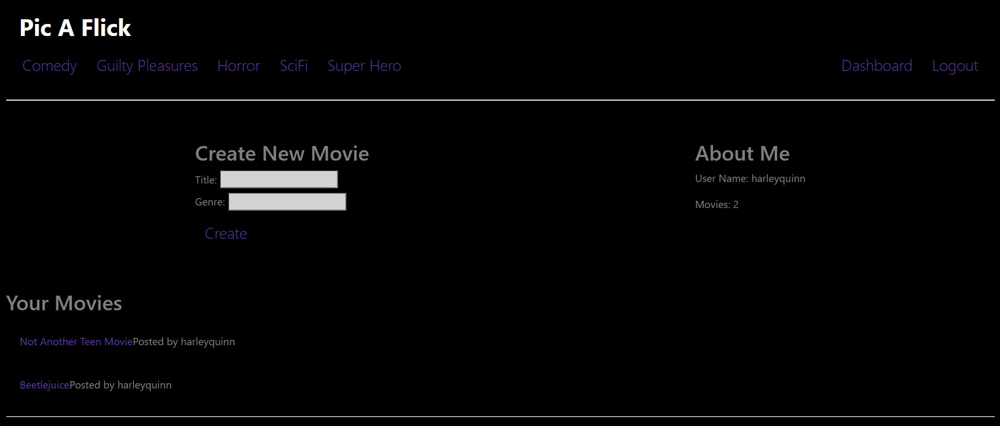

# Pic-A-Flick

## License
  

## Description
A full stack application where users can create movies and vote for their favorites by genre.

Deployed application: 
https://pic-a-flick345567.herokuapp.com/

## Screenshots
### Homepage

### Dashboard

## Table of Contents
  * [Installation](#installation)
  * [Usage](#usage)
  * [Contributing](#contributing)
  * [Questions](#questions)
        
## Installation
Enter `npm install` in the terminal to install the necessary dependencies.
   
## Usage
- Enter `node server.js` or `npm start` to connect to the localhost.
- Enter `http://localhost:3001/` in the address bar to use application.

## Contributing
*Charity Rogers*  
*Jerod Wade*  
*Michael Pinkston*  

## Questions
If you have any questions or concerns, please contact us!

  - Charity's GitHub: https://github.com/rogerscl116
  - Jerod's GitHub: https://github.com/jwade4207
  - Michael's GitHub: https://github.com/Miguel-Con-Queso
